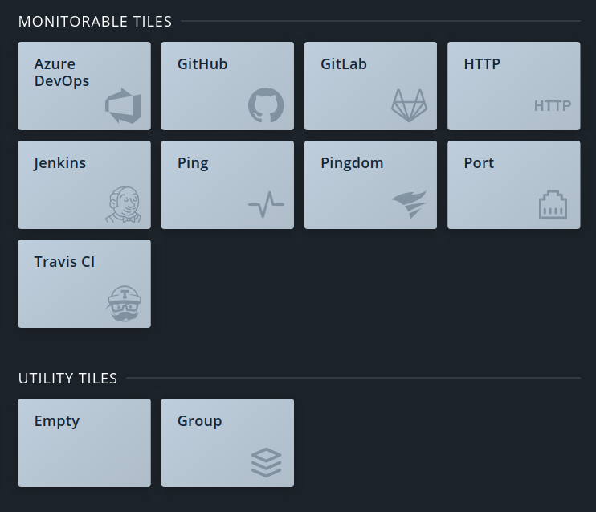
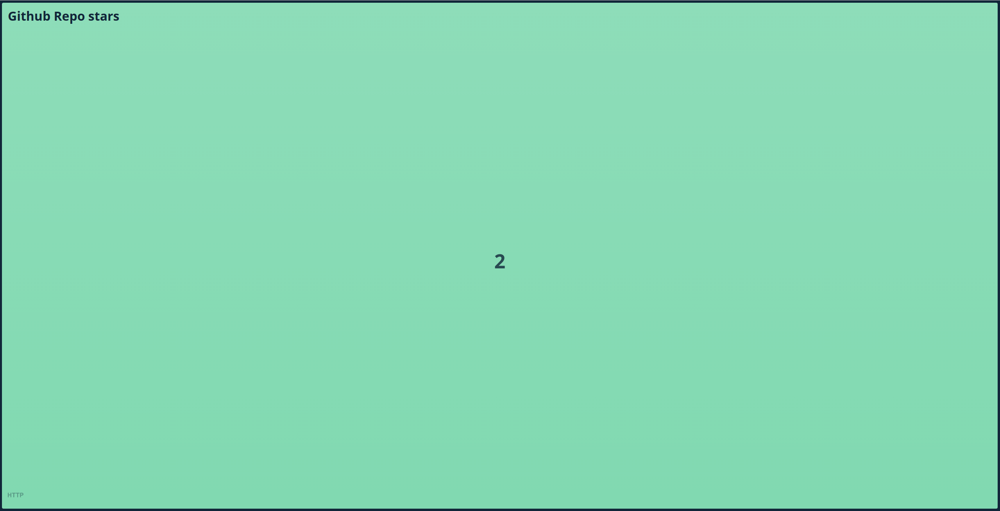
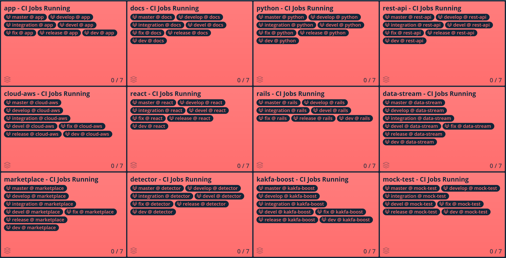

<p align="center">
  <a href="https://monitoror.com"> 
    
  </a>
</p>
-----

# Monitoror

Monitoror is a wallboard monitoring app to monitor server status; monitor CI builds progress or even display critical values.


## Demo

Go to ```demo``` and run ``` run.sh```
<p align="center">
  <a href="http://127.0.0.1:8080/">
     <br>
    Visit Monitoror demo
  </a>
</p>


## Getting started

Monitoror is a single file app written in Go which can be run on these platforms:

- Linux (64bits, ARM)
- macOS
- Windows (64bits)

The app is divided into two parts: Core and UI.

Core is the server-side Monitoror HTTP API, configured by the environment variables or `.env` file.

UI is the client-side Monitoror loaded in browser, which is the wallboard itself.

[Visit the Monitoror website for more details](https://monitoror.com)


## Documentation

All details about [**installation**](https://monitoror.com/documentation/#installation) and [**configuration**](https://monitoror.com/documentation/#configuration) are on [our documentation](https://monitoror.com/documentation/)


## Development

See our [development guide](https://monitoror.com/guides/#development)

## To generate the dashboard of gitlab with multiple projects and multple branches
- Use script to auto generate
```
python gen_conf.py
```
<p align="center">
  <a href="Gitlab Demo"> 
    
  </a>
</p>

